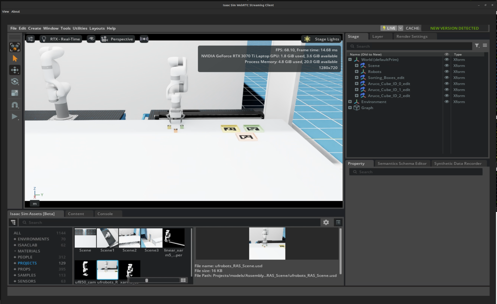

# isaacsim-webrtc
Demo showing Nvidia Isaac Sim hosted using the web client.

# Isaac Sim Container Installation

Perform the container installation of Isaac Sim following the [official documentation](https://docs.isaacsim.omniverse.nvidia.com/latest/installation/install_container.html).


```bash

mkdir isaac-sim-docker

cd isaac-sim-docker/

touch Dockerfile

nano Dockerfile

```

Add these contents into the docker file

```bash
FROM nvcr.io/nvidia/isaac-sim:4.5.0

RUN apt-get update && apt-get -y upgrade

# Configure persistent asset paths
RUN echo '[settings]' >> /isaac-sim/apps/isaacsim.exp.base.kit && \
    echo 'persistent.isaac.asset_root.default = "/isaac-sim/isaacsim_assets/Assets/Isaac/4.5"' >> /isaac-sim/apps/isaacsim.exp.base.kit && \
    echo 'exts."isaacsim.asset.browser".folders = [' >> /isaac-sim/apps/isaacsim.exp.base.kit && \
    echo '  "/isaac-sim/isaacsim_assets/Assets/Isaac/4.5/Isaac/Projects",' >> /isaac-sim/apps/isaacsim.exp.base.kit && \
    echo ']' >> /isaac-sim/apps/isaacsim.exp.base.kit
```
Build docker file

```bash

docker build -t isaacsim:nr . 

```
Generate the build and run files for easy control

```bash
touch build.sh

touch run.sh

chmod +x build.sh

chmod +x run.sh
```
Make a working directory
```bash
mkdir demo2_ws

```
Create a folder to access the custom assets
```bash
mkdir isaacsim_assets

```

Add this to the build file

```bash
docker build -t isaacsim:nr .
```

Add this to the run.sh file

```bash
docker run --name isaac-sim --entrypoint bash -it --runtime=nvidia --gpus all -e "ACCEPT_EULA=Y" --rm ->
    -e "PRIVACY_CONSENT=Y" \
    -v ~/docker/isaac-sim/cache/kit:/isaac-sim/kit/cache:rw \
    -v ~/docker/isaac-sim/cache/ov:/root/.cache/ov:rw \
    -v ~/docker/isaac-sim/cache/pip:/root/.cache/pip:rw \
    -v ~/docker/isaac-sim/cache/glcache:/root/.cache/nvidia/GLCache:rw \
    -v ~/docker/isaac-sim/cache/computecache:/root/.nv/ComputeCache:rw \
    -v ~/docker/isaac-sim/logs:/root/.nvidia-omniverse/logs:rw \
    -v ~/docker/isaac-sim/data:/root/.local/share/ov/data:rw \
    -v ~/docker/isaac-sim/documents:/root/Documents:rw \
    -v ~/isaac-sim-docker/demo2_ws:/isaac-sim/demo2_ws:rw \
    -v ~/isaac-sim-docker/isaacsim_assets:/isaac-sim/isaacsim_assets:rw \
    isaacsim:nr
```

Build the application
```bash
./build.sh
```

Run the applicaion 
```bash
./run.sh
```

# WebRTC for GUI

Download the Nvidia web rtc application from the [official website](https://docs.isaacsim.omniverse.nvidia.com/latest/installation/manual_livestream_clients.html)


Run the application

```bash
cd ~/Downloads
./isaacsim-webrtc-streaming-client-1.0.6-linux-x64.AppImage 
```

Now the WebRTC-Nvidia container link is established. Make your packages and modification in the demo2_ws folder, which will be linked to the container and its applications.


# Working with VS Code
Open VS code and connect with the running container following this [instruction](https://learn.microsoft.com/en-us/visualstudio/docker/tutorials/docker-tutorial).

# Run Isaac Sim with WebRTC

```bash
./isaac-sim.streaming.sh --allow-root 
```

# Custom Assets
Edit the isaac sim file available in /isaac-sim/apps/isaacsim.exp.base.kit

Add the following code to create a custom project folder

```
[settings]
persistent.isaac.asset_root.default = "/home/isaac-sim/isaacsim_assets/Assets/Isaac/4.5"
exts."isaacsim.asset.browser".folders = [
  "/home/isaac-sim/isaacsim_assets/Assets/Isaac/4.5/Isaac/Projects",
]
```
Run IsaacSIm WebRTC with custom asset library added
```
./isaac-sim.streaming.sh --/persistent/isaac/asset_root/default="/isaac-sim/isaacsim_assets/Assets/Isaac/4.5" --allow-root

```

Isaacsim WebRTC loaded with custom assets


